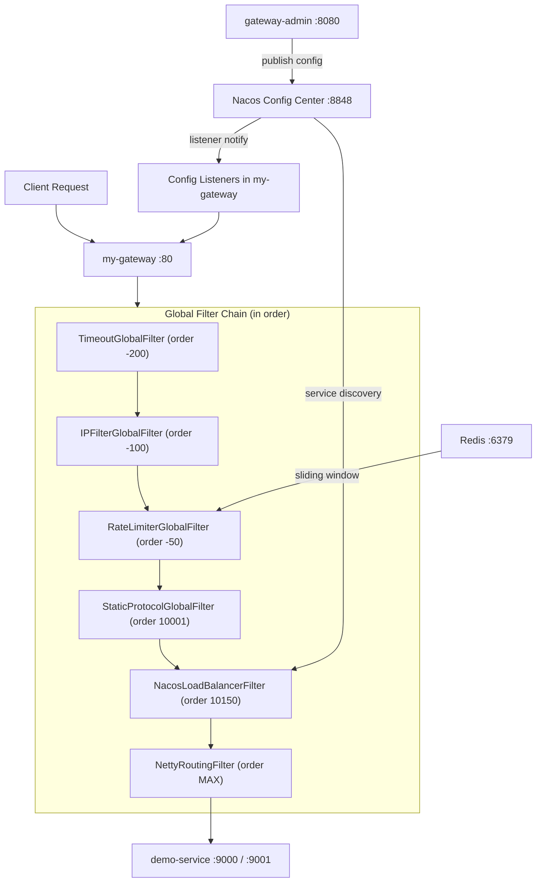

# Architecture & Data Flow

## 🎬 Demo Video

▶️ **[Watch on YouTube](https://youtu.be/JASijtZ5cNk)** — see the full system in action.

---

## 📊 Overall Architecture



---

## ⏳ Filter Execution Order

```
Request enters gateway
  │
  ▼  order -200  TimeoutGlobalFilter         → Inject timeout params into route metadata
  ▼  order -100  IPFilterGlobalFilter        → IP whitelist / blacklist check  →  403 if blocked
  ▼  order  -50  RateLimiterGlobalFilter     → Redis sliding-window rate limit  →  429 if exceeded
  ▼  order 10001 StaticProtocolGlobalFilter  → Resolve static:// to real http://ip:port
  ▼  order 10150 NacosLoadBalancerFilter     → Resolve lb:// to real http://ip:port
  ▼  order  MAX  NettyRoutingFilter          → Forward request (applies timeout params from metadata)
```

---

## ⚡ Config Propagation Flow

```
Gateway Admin
    │
    │  REST API (create / update / delete)
    ▼
Nacos Config Center
    │  gateway-routes.json
    │  gateway-services.json
    │  gateway-plugins.json
    │
    │  Nacos listener push (< 1s)
    ▼
my-gateway (Config Listeners)
    ├── NacosRouteDefinitionLocator  →  RefreshRoutesEvent  →  SCG CachingRouteLocator rebuild
    ├── StaticProtocolGlobalFilter   →  service cache cleared
    └── NacosPluginConfigListener    →  PluginConfigManager in-memory update
```

---

## ⚡ Real-Time Update Latency

| Operation | Propagation Path | Effective Latency |
|-----------|-----------------|-------------------|
| Add / update / delete **route** | Nacos → `NacosRouteDefinitionLocator` → `RefreshRoutesEvent` → SCG rebuild | < 1 s |
| Add / update / delete **service** | Nacos → `StaticProtocolGlobalFilter` listener → cache cleared | < 1 s |
| Add / update / delete **plugin** | Nacos → `NacosPluginConfigListener` → `PluginConfigManager` in-memory update | < 1 s |
| Delete **entire plugin config file** | Nacos pushes empty content → `PluginConfigManager` clears all plugin cache | < 1 s |

> Deleting a route in the Admin Console causes the gateway to return **HTTP 404 immediately** — no restart required.

---

## 🗺️ Nacos Config Data IDs

| Data ID | Content | Consumer |
|---------|---------|----------|
| `gateway-routes.json` | Route definitions | `NacosRouteDefinitionLocator` |
| `gateway-services.json` | Static service instances | `StaticProtocolGlobalFilter` |
| `gateway-plugins.json` | Rate limiter / IP filter / Timeout | `PluginConfigManager` |
